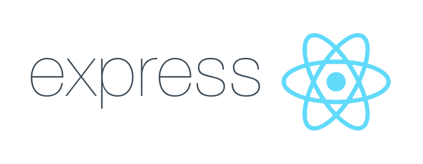
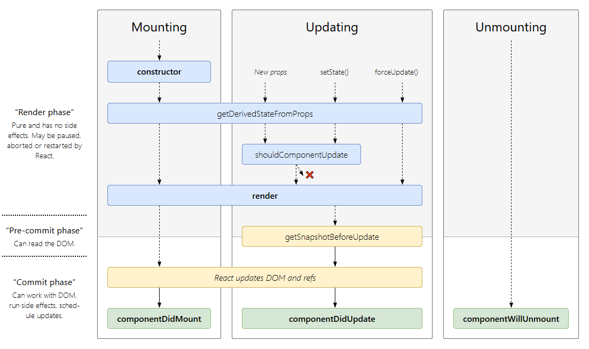
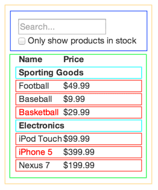

import { Split } from 'mdx-deck/layouts'
export { default as theme } from "./theme"



---

## Table of Contents

- ``npm``, ``yarn``, ``package.json``, Lockfiles
- Backend (Express, REST, MongoDB, Deployment, Testing)
- Frontend (React, Main Concepts, Testing)
- Last Words

---

# Package Manager

---

## Package Manager

- either `npm` or `yarn`
- manage dependencies, scripts, meta-informations, ...
- first thing to look at: `package.json`

---

## Typical package.json

```json
{
  "name": "retro",
  "version": "0.1.0",
  "private": true,
  "scripts": { },
  "dependencies": { },
  "devDependencies": { },
  "proxy": "http://localhost:8081"
}
```

https://docs.npmjs.com/files/package.json

---

## Bootstrapping

- run `yarn init` on an empty folder
- add dependencies with `yarn add <library>`
- add dev-dependencies with `yarn add --dev <library>`
- run scripts with `yarn <script_name>`
- install dependencies with `yarn`
- and please... add `node_modules` to `.gitignore`

---

## Lockfiles

- to get consistent installs across machines
- lockfiles contain the exact version of each dependency
- always commit!
- `yarn.lock` or `package-lock.json`

---

# Backend with Express

---

## Setup

- `yarn init`
- `yarn add express`
- `yarn add --dev nodemon`

```json
"scripts": {
  "start": "nodemon ./src/server.js"
}
```

- `yarn start`

---

## Hello World


```javascript
const express = require("express");
const http = require("http");

// init express app and supply it to an http server
const app = express();
const server = http.createServer(app);

app.get("/", (req, res) => {
  res.send({ hello: "world" });
});

const port = 8081;
server.listen(port, () => console.log(`Listening on port ${port}`));
```

---

## Sample Project Structure

```
backend/
|__ node_modules/
|__ src/
|   |__ config/       Environment config
|   |__ db/           Database config
|   |__ middleware/   Own middlewares
|   |__ models/       DB Models
|   |__ public/       Files you serve
|   |__ routes/       REST routes
|   |__ tests/        Unit Tests
|   |__ utils/        Utility Functions
|   |__ server.js     Server Root
|__ package.json
|__ processes.json    PM2 config
|__ yarn.lock
```

http://react-file-structure.surge.sh/

---

## HTTP-Verbs

|Verb|Description|
|---|---|
|GET|should only retrieve data|
|POST|used to submit an entity to the specified resource|
|PATCH|used to apply partial modifications to a resource|
|PUT|replaces all current representations of <br/> the target resource with the request payload|
|DELETE|deletes the specified resource|

---

## Let's develop a REST API

---

## Scenario

- we will manage users
- usage of authentication and private routes
- usage of MongoDB and Mongoose ODM

---

## Our API

|HTTP|Endpoint|Description|
|---|---|---|
|GET|/api/user/me|get logged in user|
|GET|/api/user/:username|get user by username|
|POST|/api/user/|user registration|
|POST|/api/user/login|user login|
|DELETE|/api/user/:id|delete user by ID|
|DELETE|/api/user/logout|user logout|

---

## Setup

- install MongoDB and Robo3T
- get Postman or Insomnia

```
$ mkdir backend && cd backend
$ yarn init
$ yarn add express body-parser mongodb mongoose lodash jsonwebtoken bcryptjs
$ yarn add --dev nodemon chai mocha supertest
$ mkdir src && cd src && touch server.js
// add start script...
// edit server.js ...
$ yarn start
```
---

# Live Example

---

## Run Forever with PM2

```json
{
  "apps": [{
    "name": "UserManagement",
    "script": "src/server.js",
    "watch": "src/",
    "ignore_watch": "src/uploads",
    "log_date_format": "YYYY-MM-DD HH:mm Z"
  }]
}
```

https://pm2.io/runtime/

---

# Frontend with React

---

## Create React App

- *"Create React apps with no build configuration."*
- Version 2.0 is released since October 1st ❤️

`npx create-react-app <app_name>`

---

# Main Concepts

https://reactjs.org/docs/getting-started.html

---

## Components and Props

Components let you split the UI into independent, reusable pieces, and think about each piece in isolation.

---

### Functional and Class Components

```jsx
// Functional Component
const Welcome = props => <h1>Hello, {props.name}</h1>;
```

```jsx
// Class Component
class Welcome extends React.Component {
  render() {
    return <h1>Hello, {this.props.name}</h1>;
  }
}
```

```jsx
const App = () => <div><Welcome name="John" /></div>;
ReactDOM.render(<App/>, document.getElementById("root"));
```

---

## State and Lifecycle



---

## State

```jsx
class Clock extends React.Component {
  state = { date: new Date() };

  render() {
    return (
      <div>
        <h1>Hello World!</h1>
        <h2>It is { this.state.date.toLocaleTimeString() }</h2>
      </div>
    );
  }
}
```

---

## State and Lifecycle

```jsx
class Clock extends React.Component {
  state = { date: new Date() };
  
  componentDidMount() { 
    this.timerID = setInterval(() => this.setState({ date: new Date() }), 1000); 
  }
  
  componentWillUnmount() { 
    clearInterval(this.timerID); 
  }
  
  render() {
    return (
      <div>
        <h2>It is { this.state.date.toLocaleTimeString() }</h2>
      </div>
    );
  }
}
```

---

## Handling Events

- React events are named using camelCase, rather than lowercase.
- With JSX you pass a function as the event handler, rather than a string.

---

```jsx
class Incrementer extends React.Component {
  state = { counter: 0 };

  handleClick = event => {
    event.preventDefault();
    
    this.setState(prevState => {
      return { counter: prevState.counter + 1 };
    });
  };

  render() {
    const { counter } = this.state;
    return (
      <div>
        <p>{ counter }</p>
        <button onClick={this.handleClick}>Increment</button>
      </div>
    );
  }
}
```

---

## Conditional Rendering

In React, you can create distinct components that encapsulate behavior you need. Then, you can render only some of them, depending on the state of your application.

---

## Conditional Rendering

```jsx
const UserGreeting = () => <h1>Welcome Back!</h1>;

const GuestGreeting = () => <h1>Please sign up.</h1>;

const Greeting = props => {
  const isLoggedIn = props.isLoggedIn;
  
  if (isLoggedIn)
    return <UserGreeting />;
  
  return <GuestGreeting />;
}

ReactDOM.render(<Greeting isLoggedIn={false} />, document.getElementById("root"));
```

---

## Lists and Keys

```jsx
const NumberList = props => {
  const numbers = props.numbers;
  const listItems = numbers.map(num => <li key={num.toString()}>{ num }</li>);

  return <ul>{ listItems }</ul>
}

const numbers = [1, 2, 3, 4, 5];
ReactDOM.render(<NumberList numbers={numbers} />, document.getElementById("root"));
```

- Keys help React identify which items have changed, are added, or are removed. 
- Keys should be given to the elements inside the array to give the elements a stable identity.

---

## Forms

```jsx
class NameForm extends React.Component {
  state = { name: "" };
  handleChange = event => this.setState({ name: event.target.value });
  handleSubmit = event => {
    event.preventDefault();
    alert("Submitted Name: " + this.state.name);
  };
  render() {
    return (
      <form onSubmit={this.handleSubmit}>
        <label>
          Name:
          <input type="text" value={this.state.name} onChange={this.handleChange} />
        </label>
        <input type="submit" value="Submit" />
      </form>
    );
  }
}
```

---

## Thinking in React

1. Break the UI into a Component Hierarchy
2. Build a static version in React
3. Identify the minimal (but complete) representation of UI state
4. Identify where your state should live
5. Add inverse data flow

https://reactjs.org/docs/thinking-in-react.html

---

export default Split



## Break the UI into a Component Hierarchy

- ``FilterableProductTable`` (orange)
- ``SearchBar`` (blue)
- ``ProductTable`` (green)
- ``ProductCategoryRow`` (turquoise)
- ``ProductRow`` (red)

---

## Build a static version in React

- Build a version that takes your data model and renders the UI but has no interactivity
- Don't use state at all to build this static version
- State is reserved only for interactivity, that is, data that changes over time
- Pass data using ``props``

---

## Identify the minimal (but complete) representation of UI state

- You first need to think of the minimal set of mutable state that your app needs (DRY!)
- If you're for example building a TODO list, just keep an array of the TODO items around and don't keep a separate state variable for the count, just compute the length of the array

---

## Our Data

- The original list of products
- The search text the user has entered
- The value of the checkbox
- The filtered list of products

---

## Figure out State

1. Is it passed in from a parent via props? If so, it probably isn’t state.
2. Does it remain unchanged over time? If so, it probably isn’t state.
3. Can you compute it based on any other state or props in your component? If so, it isn’t state.

---

## What remains

- The search text the user has entered
- The value of the checkbox

---

## Identify where your state should live

- Identify every component that renders something based on that state
- Find a common owner component
- Either the common owner or another component higher up in the hierarchy should own the state

---

export default Split


## Our Example

- `ProductTable` (green) needs to filter the product list based on state
- `SearchBar` (blue) needs to display the search text and checked state
- The common owner component is `FilterableProductTable` (orange)
- It conceptually makes sense for the filter text and checked value to live in `FilterableProductTable`

---

## Add inverse data flow

- Now it's time to support data flowing the other way
- `FilterableProductTable` will pass callbacks to `SearchBar` that will call `setState()`

---

# Live Example

---

## Some Neat Libraries/Frameworks

- [react-testing-library](https://github.com/kentcdodds/react-testing-library)
- [react-beautiful-dnd](https://github.com/atlassian/react-beautiful-dnd)
- [react-responsive-modal](https://react-responsive-modal.leopradel.com/)
- [react-fontawesome](https://github.com/FortAwesome/react-fontawesome)
- [react-pose](https://popmotion.io/pose/)
- [prop-types](https://www.npmjs.com/package/prop-types)
- [@reach/router](https://reach.tech/router)
- [mdx-deck](https://github.com/jxnblk/mdx-deck)
- [styled-components](https://github.com/styled-components/styled-components)
- [bulma](https://bulma.io/)
- [material-ui](https://material-ui.com/)

---

# Last Words

- Learning by doing 👩‍💻
- Be curious, Try out new stuff! 🤓
- Google is your friend 🔍
- Use your notepad, if stuck 🗒️
- Read Blogs 📰
- Contribute to Open Source 💻
- Online Courses 🎓

---

# Happy Hacking!

